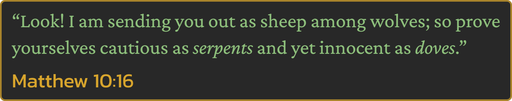

# 🐍 Milan Wesołowski

`Programmer`
`Cinephile`
`Gamer`
`Cowboy`

👋 Hey hey! I'm a Polish self-taught frontend developer who got immersed in programming and can't tear myself away from it. Since January 1st, 2024, I've had an account on **GitHub**, and in my free time, I tinker with my projects. I take great care to ensure they have a thoughtful concept, careful execution and appealing visual design. Well, I'm quite meticulous, haha. 😊

💪 I'm currently looking for a programming job, staying positive that the right opportunity will come my way soon! ✅

---

### 👨‍💻 My Remarkable Abilities

  
  
  
  
  
  
  

**And I'm dedicated to expanding my skills and knowledge every day!** 🔥

---

### 🏹 Portfolio, Contact & Other Links

  

  

  

  

  
  
  

